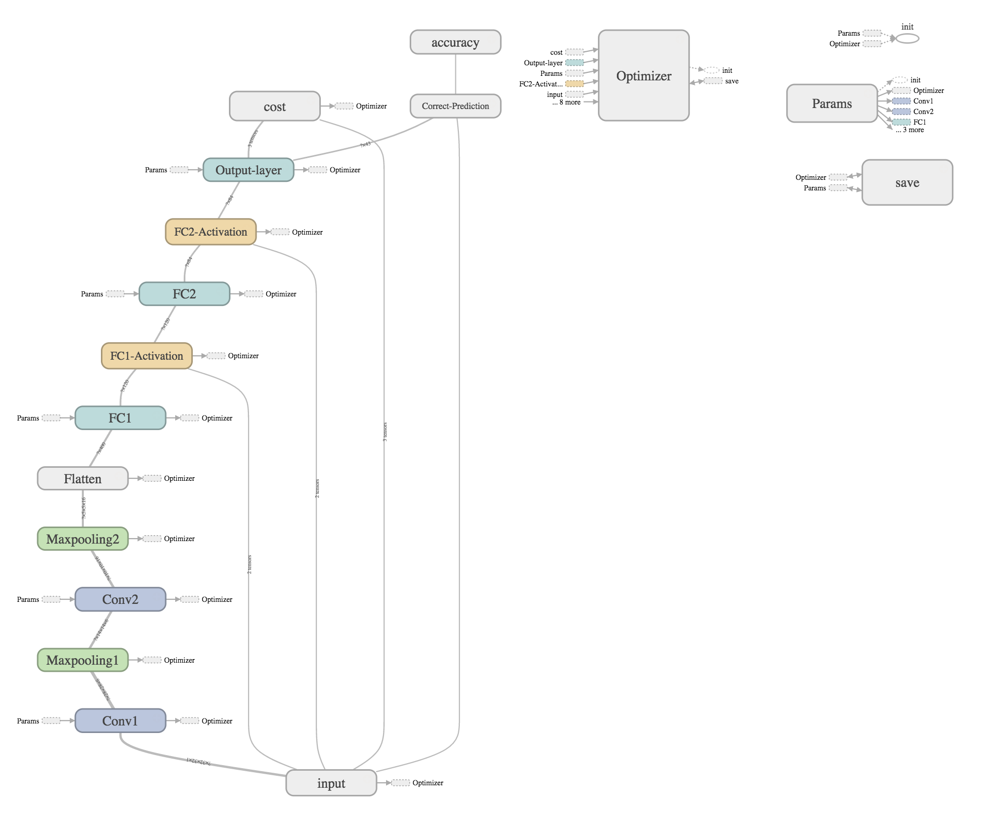

# Introduction

Built and trained a convolutional neural network based on LeNet-5 CNN to classify traffic signs using **TensorFlow** library. Trained a model so it can decode traffic signs from natural images by using the [German Traffic Sign Dataset](http://benchmark.ini.rub.de/?section=gtsrb&subsection=dataset). I got 93% accuracy on validation data set.

**Visualization of this CNN**



# Pipeline
- Resize images if necessary
- Normalize images
- Shuffle them all
- Do train, test and validation split


### Dependencies

This project requires **Python 3.5** and the following Python libraries installed:

- [Jupyter](http://jupyter.org/)
- [NumPy](http://www.numpy.org/)
- [SciPy](https://www.scipy.org/)
- [scikit-learn](http://scikit-learn.org/)
- [TensorFlow](http://tensorflow.org)
- [Matplotlib](http://matplotlib.org/)
- [Pandas](http://pandas.pydata.org/) (Optional)

Run this command at the terminal prompt to install [OpenCV](http://opencv.org/). Useful for image processing:

- `conda install -c https://conda.anaconda.org/menpo opencv3`

### Dataset

1. [Download the dataset](https://d17h27t6h515a5.cloudfront.net/topher/2016/November/581faac4_traffic-signs-data/traffic-signs-data.zip). This is a pickled dataset in which we've already resized the images to 32x32.
```
git clone https://github.com/udacity/CarND-Traffic-Signs
cd CarND-Traffic-Signs
jupyter notebook Traffic_Signs_Recognition.ipynb
```
3. Follow the instructions in the `Traffic_Signs_Recognition.ipynb` notebook.

# License 

This code is licensed under [MIT License](https://opensource.org/licenses/MIT)

